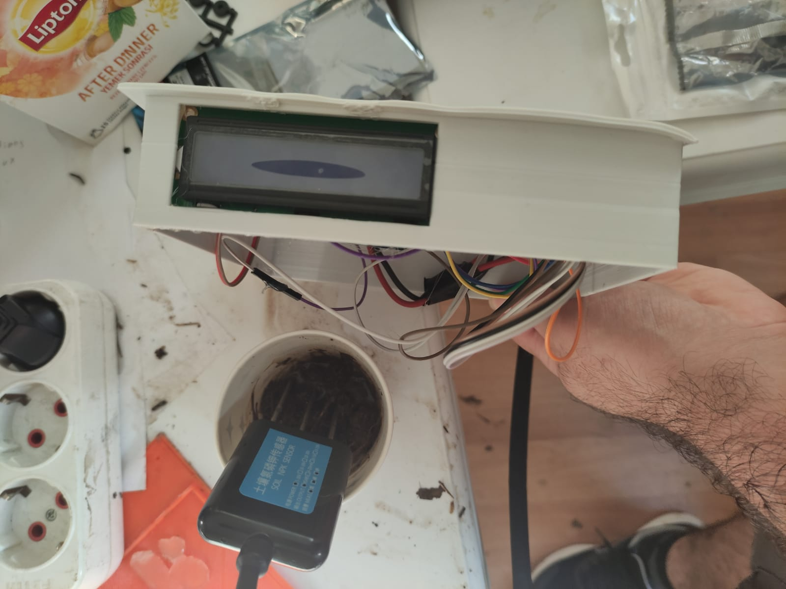
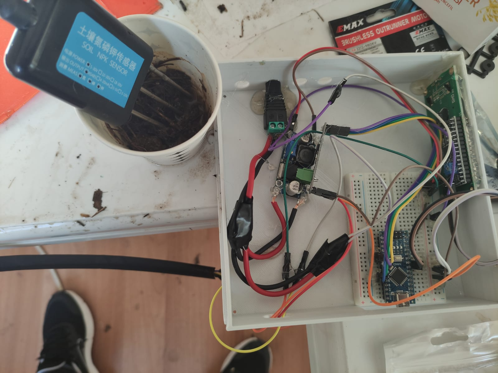

# TOAF

[TOAF](https://www.toafx.org/) ekibi farklı üniversitelerden ve farklı disiplinlerden takım arkadaşlarının, ülkedeki tarım verimliliği ve otomasyon ihracatını artırma hedefiyle kurulmuş bir arge takımıdır. TEKNOFEST 2020 de 1468 başvuru arasında finale kalarak geliştirilmesini yaptığımız araçla ilk 10 takım arasına girdik. Uzun süren çalışmalarımız sonucunda elde ettiğimiz takım çalışması deneyimiyle çalışmalarımıza TEKNOFEST 2021 ile devam ediyoruz. 

**Bu github repomuzda sizlere NPK sensörü ile yaptığımız çalışmalarımızı sunmaktayız.**

## NPK sensörü

* Tarımda Toprak Besin Maddesi için Toprak NPK Sensörü 

Toprak azot fosfor ve potasyum sensörü (toprak NPK sensörü olarak da adlandırılır), topraktaki azot, fosfor ve potasyum içeriğini tespit etmek ve topraktaki azot, fosfor ve potasyum içeriğini tespit ederek toprağın verimliliğini değerlendirmek için uygundur. Toprak, böylece toprak verimliliğinin sistematik değerlendirmesini kolaylaştırır. Toprak npk sensörünün paslanmaz çelik probu uzun süre toprağa gömülebilir ve uzun süreli elektroliz, tuz ve alkali korozyonuna dayanıklıdır. Kabuk vakumlu ve tamamen su geçirmezdir. Alkali toprak, asit toprak, substrat toprağı, fide yatağı toprağı ve hindistan cevizi kepeği toprağının tespiti için geçerli olabilir.

 

Optik **NPK sensörlerinin** prensibi, yansıyan ışığın özellikleri toprağın fiziksel ve kimyasal özelliklerinden dolayı değişiklik gösterecek şekilde, gelen ışık ve toprak yüzey özellikleri arasındaki etkileşime dayanır.

**Hesaplama dört adımda açıklanabilir:**

1. Genel hacmi elde etmek için hacimleri (ml) birlikte ekleyin.
2. Bireysel birimleri toplam hacme bölün.
3. Sonucu, karşılık gelen her oranın N, P ve K ile çarpın.
4. Ns, Ps ve Ks ekleyin.

NPK, bitkilerin ihtiyaç duyduğu en önemli besinlerden üçü olan azot(N), fosfor(P) ve potasyum(K) anlamına gelir. NPK'yı takip eden sayılar, her bir besinin yüzde miktarlarıdır. 10-5-5 NPK değeri, gübrenin %10 azot, %5 fosfor ve %5 potasyum içerdiği anlamına gelir.

